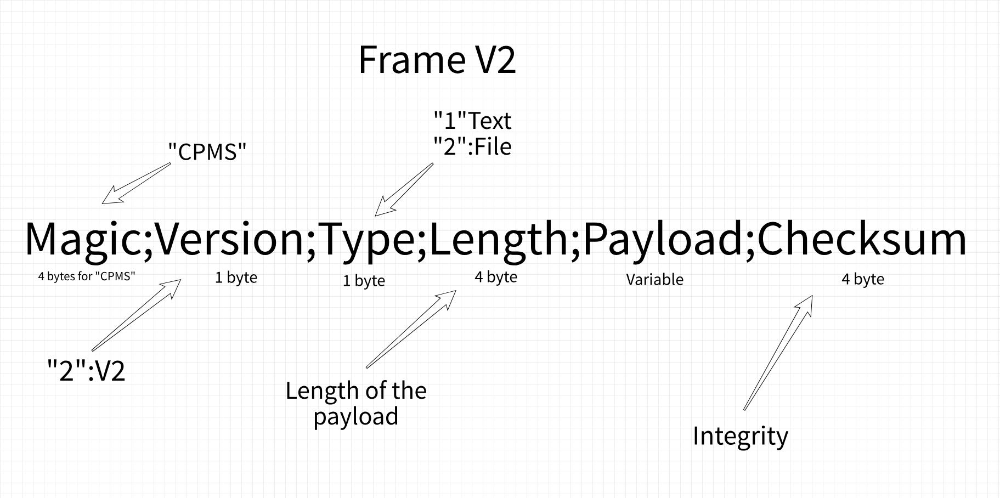

# EN 🇺🇸

## CPMS

**CPMS** stands for **"Communication Protocol Mohamed Seif"**.
It is a modular, privacy‑oriented communication protocol designed to give users full control over their data flow and network exchanges.

Unlike traditional protocols that impose rigid structures and trust the underlying transport layer, CPMS is built from the ground up to be **implementation‑agnostic** (compatible with Rust, C++, and any language capable of calling a C interface) and **transport‑agnostic** (works over TCP, UDP, serial links, LoRa, Bluetooth, or even physical custom radio).

The protocol is not a monolithic library. It is a **lightweight frame format** combined with a **shared DLL** that contains all core operations: frame construction, parsing, integrity checking, and optional obfuscation.

---

## Core Features

- **Fixed‑size header** (20 bytes) – MAGIC, VERSION, TYPE, LENGTH, TIMESTAMP.
- **Variable payload** – carry anything: text, binary, encrypted data, file chunks.
- **JCS32 checksum** – our own integrity algorithm, not a standard CRC.
- **DLL‑based architecture** – shared logic between different languages and platforms.
- **Modular by design** – add encryption, authentication, or custom flags without breaking the frame structure.
- **Ready for low‑bandwidth / long‑range** – LoRa, radio modems, satellite.

---

## JCS32 – Joint Checksum Standard 32

JCS32 is our **custom integrity algorithm**, designed specifically for CPMS.

It takes the input data, runs it through a chaotic propagation loop over 64 bits, compresses the result, applies a bit‑permutation step, and expands it to **8 bytes**.

**No CRC. No standard. Just our own math.**

This ensures that:
- Two different inputs are extremely unlikely to produce the same checksum.
- No external dependency (zlib, etc.) is required.
- The algorithm remains fully under our control.

> ⚠️ The buffer returned by the JCS32 function is dynamically allocated.
> It must be freed using `FreeBuffer()` after use.

---

## Why CPMS ?

Most existing protocols make assumptions about the network, the transport, or the data format.  
CPMS does not.

You decide:
- What runs on top of it (chat, file transfer, command & control, telemetry).
- What runs below it (TCP, UDP, radio, serial).
- Who can read the payload (encryption is your choice, not forced).
- How integrity is verified (JCS32 is ours, but you can add more).

**Your data, your rules. Your network, your format.**

---

## Workflow / How It Works

CPMS is built around a **shared DLL** written in C++. This DLL contains all the core logic: frame encoding, decoding, JCS32 checksum calculation, and optional obfuscation.

On top of this DLL, we provide a **Rust wrapper** that loads the DLL at runtime using FFI (`libloading` on Windows / `dlopen` on Unix). The wrapper exposes simple, safe functions to the Rust application: `encode()`, `decode()`, `free_buffer()`.

### Step by step (encoding)

1. The Rust application calls `encode("hello")`.
2. The wrapper converts the string to a C‑compatible format (`CString`).
3. The wrapper calls the DLL's `Encode` function with the input data.
4. The DLL builds the frame:  
   `[MAGIC][VERSION][TYPE][LENGTH][TIMESTAMP][PAYLOAD]`
5. The DLL computes the **JCS32** checksum over the entire frame.
6. The DLL appends the checksum (8 bytes) and returns a pointer to the final frame.
7. The wrapper copies the frame data into a Rust `Vec<u8>` and calls `free_buffer()`.
8. The Rust application gets a clean `Vec<u8>` ready to send over the network.

### Step by step (decoding)

1. The Rust application calls `decode(&received_bytes)`.
2. The wrapper passes the raw bytes to the DLL's `Decode` function.
3. The DLL recomputes JCS32 over the frame (excluding the last 8 bytes).
4. If checksums match, the DLL extracts the PAYLOAD and returns it.
5. The wrapper copies the payload into a Rust `String` and frees the DLL buffer.
6. The Rust application gets the original message.

This architecture keeps the **core protocol logic** in one place (the DLL), while allowing **any language** to use it through a thin wrapper. The Rust wrapper is just an example – the same DLL can be called from C++, Python, or any language with FFI support.

---

## Implementation

CPMS has been implemented **from scratch** in **Rust** and **C++**.

- A **shared DLL** contains the core logic: frame encoding, decoding, JCS32 checksum, and optional data obfuscation.
- The **Rust wrapper** uses FFI (`libloading` or direct `LoadLibrary`) to call the DLL functions.
- The **C++ side** can use the same DLL natively.

This allows the same protocol to run in high‑level applications (Rust GUI, CLI tools) and low‑level systems (C++ servers, embedded devices, radio gateways).

---

## Current Status

### V1 (Legacy Frame) – COMPLETE ✅

- Frame format: `["MS" 2b][Version 1b][Type 1b][Payload Xb]`
- Basic encode/decode in C++ DLL
- Rust wrapper using FFI (`libloading`)
- Cross‑language communication validated (Rust ↔ C++)

### V1 Wrapper (Rust) – COMPLETE ✅

- `encode()` returns `Vec<u8>`
- `decode(&[u8])` returns `Result<String>`
- Memory management via `free_buffer()`
- Early error handling with `Result` type

### JCS32 – IN PROGRESS 🚧

- Algorithm implemented in C++ DLL
- Returns an 8‑byte checksum
- Integration with V2 frame pending
- Rust wrapper update planned

### V2 Frame – IN PROGRESS 🚧

**New format (V2):**

["CPMS" 4b][Version 1b][Type 1b][Length 4b][Payload Xb][Checksum 8b]

| Field     | Size  | Description                          |
|-----------|-------|--------------------------------------|
| MAGIC     | 4b    | Fixed signature "CPMS"               |
| VERSION   | 1b    | Protocol version (0x02 for V2)       |
| TYPE      | 1b    | Message type (1=Text, 2=File, ...)   |
| LENGTH    | 4b    | Size of the payload in bytes         |
| PAYLOAD   | Xb    | Actual data (text, file chunk, etc.) |
| CHECKSUM  | 8b    | Integrity check (JCS32)              |

**V2 frame diagram:**

**Key improvements over V1:**

- Magic extended to 4 bytes: `"CPMS"`
- Explicit `Length` field – no more payload ambiguity
- `Checksum` extended to 8 bytes – stronger integrity
- Version field ready for future extensions

### Next Steps

1. Update C++ DLL to support V2 frame (encode/decode with Length + Checksum 8b)
2. Update Rust wrapper to handle V2 (parse new fields, validate JCS32)
3. Cross‑language test (C++ encode → Rust decode, and reverse)
4. Simple TCP client/server using the V2 wrapper
5. End‑to‑end chat over local network

---

## Philosophy

One sentence. One belief.

> **Your data, your rules. Your network, your format.**

No bloat. No unnecessary layers. No hidden telemetry.  
Just a clean, controlled, and auditable communication channel.

CPMS is not a product. It is a foundation.

---

# FR 🇫🇷

## CPMS

**CPMS** signifie **"Protocole de Communication Mohamed Seif"**.
Il s'agit d'un protocole de communication modulaire, orienté confidentialité, conçu pour donner aux utilisateurs un contrôle total sur leurs flux de données et leurs échanges réseau.

Contrairement aux protocoles traditionnels qui imposent des structures rigides et font confiance à la couche de transport sous-jacente, CPMS est construit de A à Z pour être **indépendant de l'implémentation** (compatible avec Rust, C++ et tout langage capable d'appeler une interface C) et **indépendant du transport** (fonctionne sur TCP, UDP, liaisons série, LoRa, Bluetooth, ou même une radio personnalisée).

Le protocole n'est pas une bibliothèque monolithique. C'est un **format de trame léger** combiné à une **DLL partagée** qui contient toutes les opérations de base : construction de trame, analyse, vérification d'intégrité et obfuscation optionnelle.

---

## Fonctionnalités principales

- **En‑tête de taille fixe** (20 octets) – MAGIC, VERSION, TYPE, LENGTH, TIMESTAMP.
- **Charge utile variable** – transporte n'importe quoi : texte, binaire, données chiffrées, fragments de fichiers.
- **Somme de contrôle JCS32** – notre propre algorithme d'intégrité, pas un CRC standard.
- **Architecture basée sur une DLL** – logique partagée entre différents langages et plateformes.
- **Conception modulaire** – ajoutez du chiffrement, de l'authentification ou des drapeaux personnalisés sans casser la structure de la trame.
- **Prêt pour les faibles débits / longue distance** – LoRa, modems radio, satellite.

---

## JCS32 – Joint Checksum Standard 32

JCS32 est notre **algorithme d'intégrité sur mesure**, conçu spécifiquement pour CPMS.

Il prend les données d'entrée, les fait passer dans une boucle de propagation chaotique sur 64 bits, compresse le résultat, applique une étape de permutation de bits et l'étend à **8 octets**.

**Pas de CRC. Pas de standard. Rien que nos propres maths.**

Cela garantit :
- Que deux entrées différentes aient une probabilité extrêmement faible de produire la même somme de contrôle.
- Qu'aucune dépendance externe (zlib, etc.) ne soit requise.
- Que l'algorithme reste entièrement sous notre contrôle.

> ⚠️ Le tampon retourné par la fonction JCS32 est alloué dynamiquement.
> Il doit être libéré avec `FreeBuffer()` après utilisation.

---

## Pourquoi CPMS ?

La plupart des protocoles existants font des hypothèses sur le réseau, le transport ou le format des données.  
CPMS, non.

Vous décidez :
- Ce qui fonctionne au‑dessus (chat, transfert de fichiers, commande & contrôle, télémétrie).
- Ce qui fonctionne en dessous (TCP, UDP, radio, série).
- Qui peut lire la charge utile (le chiffrement est votre choix, pas imposé).
- Comment l'intégrité est vérifiée (JCS32 est le nôtre, mais vous pouvez en ajouter d'autres).

**Vos données, vos règles. Votre réseau, votre format.**

---

## Workflow / Comment ça fonctionne

CPMS est construit autour d'une **DLL partagée** écrite en C++. Cette DLL contient toute la logique centrale : encodage, décodage des trames, calcul de la somme de contrôle JCS32 et obfuscation optionnelle.

Au‑dessus de cette DLL, nous fournissons un **wrapper Rust** qui charge la DLL à l'exécution via FFI (`libloading` sous Windows / `dlopen` sous Unix). Le wrapper expose des fonctions simples et sûres à l'application Rust : `encode()`, `decode()`, `free_buffer()`.

### Étape par étape (encodage)

1. L'application Rust appelle `encode("hello")`.
2. Le wrapper convertit la chaîne en un format compatible C (`CString`).
3. Le wrapper appelle la fonction `Encode` de la DLL avec les données d'entrée.
4. La DLL construit la trame :  
   `[MAGIC][VERSION][TYPE][LENGTH][TIMESTAMP][PAYLOAD]`
5. La DLL calcule la somme de contrôle **JCS32** sur l'ensemble de la trame.
6. La DLL ajoute la somme de contrôle (8 octets) et retourne un pointeur vers la trame finale.
7. Le wrapper copie les données de la trame dans un `Vec<u8>` Rust et appelle `free_buffer()`.
8. L'application Rust obtient un `Vec<u8>` propre prêt à être envoyé sur le réseau.

### Étape par étape (décodage)

1. L'application Rust appelle `decode(&octets_recus)`.
2. Le wrapper transmet les octets bruts à la fonction `Decode` de la DLL.
3. La DLL recalcule JCS32 sur la trame (sans les 8 derniers octets).
4. Si les sommes de contrôle correspondent, la DLL extrait la CHARGE UTILE et la retourne.
5. Le wrapper copie la charge utile dans une `String` Rust et libère le tampon de la DLL.
6. L'application Rust obtient le message original.

Cette architecture maintient la **logique centrale du protocole** dans un seul endroit (la DLL), tout en permettant à **n'importe quel langage** de l'utiliser via une fine couche d'adaptation. Le wrapper Rust n'est qu'un exemple – la même DLL peut être appelée depuis C++, Python ou tout langage disposant d'un support FFI.

---

## Implémentation

CPMS a été implémenté **de zéro** en **Rust** et **C++**.

- Une **DLL partagée** contient la logique centrale : encodage, décodage des trames, somme de contrôle JCS32 et obfuscation optionnelle des données.
- Le **wrapper Rust** utilise FFI (`libloading` ou `LoadLibrary` direct) pour appeler les fonctions de la DLL.
- Le **côté C++** peut utiliser la même DLL nativement.

Cela permet au même protocole de fonctionner à la fois dans des applications haut niveau (interface Rust, outils en ligne de commande) et dans des systèmes bas niveau (serveurs C++, dispositifs embarqués, passerelles radio).

---

## État actuel

### V1 (Trame historique) – TERMINÉE ✅

- Format de trame : `["MS" 2b][Version 1b][Type 1b][Payload Xb]`
- Encodage/décodage basique dans la DLL C++
- Wrapper Rust utilisant FFI (`libloading`)
- Communication croisée validée (Rust ↔ C++)

### Wrapper V1 (Rust) – TERMINÉ ✅

- `encode()` retourne `Vec<u8>`
- `decode(&[u8])` retourne `Result<String>`
- Gestion de la mémoire via `free_buffer()`
- Gestion précoce des erreurs avec le type `Result`

### JCS32 – EN COURS 🚧

- Algorithme implémenté dans la DLL C++
- Retourne une somme de contrôle de 8 octets
- Intégration avec la trame V2 en attente
- Mise à jour du wrapper Rust planifiée

### Trame V2 – EN COURS 🚧

**Nouveau format (V2) :**

`["CPMS" 4b][Version 1b][Type 1b][Length 4b][Payload Xb][Checksum 8b]`

| Champ     | Taille | Description                                |
|-----------|--------|--------------------------------------------|
| MAGIC     | 4b     | Signature fixe "CPMS"                      |
| VERSION   | 1b     | Version du protocole (0x02 pour V2)        |
| TYPE      | 1b     | Type de message (1=Texte, 2=Fichier, ...)  |
| LENGTH    | 4b     | Taille de la charge utile en octets        |
| PAYLOAD   | Xb     | Données réelles (texte, fragment, etc.)    |
| CHECKSUM  | 8b     | Vérification d'intégrité (JCS32)           |

**Diagramme de la trame V2 :**

**Améliorations par rapport à V1 :**

- Magic étendu à 4 octets : `"CPMS"`
- Champ `Length` explicite – plus d'ambiguïté sur la charge utile
- Champ `Checksum` étendu à 8 octets – intégrité renforcée
- Champ Version prêt pour les évolutions futures

### Prochaines étapes

1. Mettre à jour la DLL C++ pour supporter la trame V2 (encodage/décodage avec Length + Checksum 8b)
2. Adapter le wrapper Rust pour gérer V2 (analyser les nouveaux champs, valider JCS32)
3. Test croisé (encodage C++ → décodage Rust, et inversement)
4. Client/serveur TCP simple utilisant le wrapper V2
5. Chat bout‑en‑bout sur le réseau local

---

## Philosophie

Une phrase. Une conviction.

> **Vos données, vos règles. Votre réseau, votre format.**

Pas de gonflement inutile. Pas de couches superflues. Pas de télémétrie cachée.  
Juste un canal de communication propre, contrôlé et vérifiable.

CPMS n'est pas un produit. C'est une fondation.